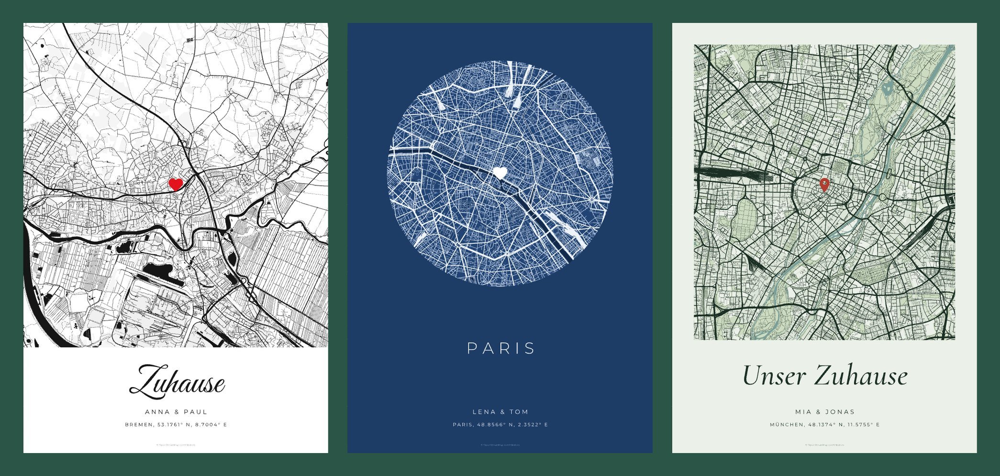

# mapr

Turn an address or a pair of coordinates into a printable map poster: a minimal street map with a heart on the spot and a short caption underneath. Everything runs in the browser, and the result downloads as a DIN A4 or A3 PNG, JPEG or SVG.



## Features

- **Find a place** by address or by coordinates, for example `53.1761, 8.7004` or `53.1761° N, 8.7004° E`. The marker sits exactly on that point, in the centre of the map.
- **Seven styles:** Classic, Noir, Atlas, Blueprint, Sand, Sage and Blush.
- **Map controls:** area from 1 to 40 km wide, line weight, and switches for parks and forests, footpaths/tracks/ditches, and buildings.
- **Marker:** heart, pin, dot or none, with your own colour and size.
- **Text:**
  - A title in one of four typefaces (script, signature, serif, sans).
  - A names line.
  - A location line that fills in with the city and coordinates when you pick a place.
  - An optional OpenStreetMap credit.
- **Layouts:** full bleed, margin, or circle.
- **Export:**
  - DIN A4 (2480 × 3508 px) or A3 (3508 × 4961 px) as PNG or JPEG at 300 dpi.
  - SVG as a vector file at 210 × 297 or 297 × 420 mm.
- Your settings are saved in the browser and come back when you reopen the page.

## Getting started

You need [Bun](https://bun.sh). Node 22.18+ or 24.12+ with npm works too.

```sh
bun install
bun dev          # dev server at http://localhost:5173
bun run build    # type-check and production build into dist/
bun lint         # oxlint + eslint
bun run format   # oxfmt
```

The build is a static site. Serve `dist/` from any static host. There is no backend and no API key.

## How it works

1. **Search.** [Nominatim](https://nominatim.org) turns an address into coordinates. Typed coordinates are used as-is, and a reverse lookup only fills in the city name for the location line.
2. **Map data.** The app downloads OpenStreetMap vector tiles from [OpenFreeMap](https://openfreemap.org).
   - It picks the most detailed zoom level (up to 14) that covers the map with at most 64 tiles.
   - Tiles are decoded with `@mapbox/vector-tile` and sorted into layers: water, parks, built-up areas, buildings, and roads by class.
   - Each tile is converted as soon as it arrives. Coordinates are projected from Web Mercator into millimetres on the poster.
3. **Drawing.** Each layer becomes one SVG path, clipped to the map frame and lightly simplified to 0.05 mm. Line widths are in millimetres and grow slightly as you zoom in.
4. **Text.** [opentype.js](https://opentype.js.org) turns the text into vector outlines, using fonts bundled through [Fontsource](https://fontsource.org). Exported SVGs therefore look the same everywhere, with no fonts to install.
5. **Export.**
   - SVG files are the poster serialized as-is.
   - PNG and JPEG are drawn from that SVG onto a canvas at 300 dpi, and the dpi is written into the file, so image viewers and print shops open it at real paper size.
   - The design is laid out once on A4. A3 has the same proportions, so it is the identical poster scaled up by √2.

## Project layout

```
src/
  App.vue                  sidebar controls and export
  components/
    PosterSvg.vue          the poster itself (map SVG + text/marker overlay)
    PosterStage.vue        preview area with crop marks and dimensions
    PlaceSearch.vue        address and coordinate search
    ThemePicker.vue        style swatches
    OptionGroup.vue        radio-button tiles used across the sidebar
    FrameShape.vue         rectangle or circle for a map frame
  composables/
    usePosterState.ts      all poster settings, saved to localStorage
    useMapGeometry.ts      loads and rebuilds the map when the view changes
    useFonts.ts            lazily loaded font outlines
  lib/
    tiles.ts               tile download, layer classification, projection to mm
    mapStyle.ts            styles, layer draw order and line widths
    layout.ts              page sizes, map frames, text positions, export dpi
    text.ts                fonts and text-to-outline layout
    geocode.ts             Nominatim search and reverse lookup
    export.ts              SVG/PNG/JPEG download
    geo.ts, markers.ts, fetch.ts, options.ts
```

## Customising

- **Add a style:** add an entry to `THEMES` in `src/lib/mapStyle.ts` and its id to `ThemeId`. `ink` colours roads, rail and the poster text, and `minor` colours side streets and paths.
- **Change line widths or draw order:** edit `LAYER_STYLES` in `src/lib/mapStyle.ts`. Widths are millimetres on the A4 master.
- **Move the map frame or text:** edit `LAYOUTS` and `TEXT_BLOCK` in `src/lib/layout.ts`. All values are in millimetres on A4.
- **Add a title typeface:** add the font files to `FONT_FILES` and an entry to `TITLE_STYLES` in `src/lib/text.ts`. Use the `.woff` files, because opentype.js can't read `.woff2`.

## Known limitations

- **Safari and A3 images:** Safari may refuse to create the A3 PNG or JPEG because it limits canvas size to about 16.7 megapixels. The app shows a message when that happens. Use the SVG instead.
- **Search usage limits:** Nominatim allows light use only (about one request per second). That's fine for personal use. For heavier traffic, point `src/lib/geocode.ts` at another geocoder.
- **Buildings are always processed:** buildings, paths and ditches are built for every map and hidden when switched off, so the switches respond instantly. In very dense cities this costs some extra processing time.
- **No advanced ligatures:** some script fonts use substitution tables opentype.js doesn't support. For those, letters are placed one by one without ligatures.

## Credits

- Map data © [OpenStreetMap](https://www.openstreetmap.org/copyright) contributors, available under the ODbL. When you print or share a poster, keep the credit line switched on (it is on by default).
- Vector tiles by [OpenFreeMap](https://openfreemap.org), using the [OpenMapTiles](https://openmaptiles.org) schema.
- Fonts: Great Vibes, Mrs Saint Delafield, Cormorant Garamond, Montserrat and Archivo, all under the SIL Open Font License, via Fontsource.
